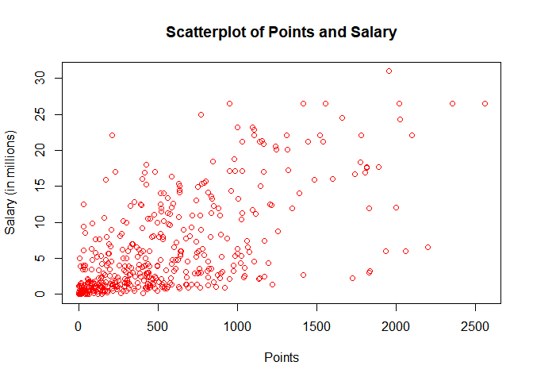
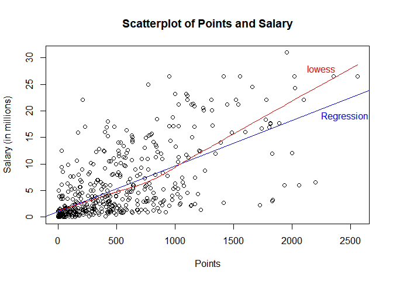
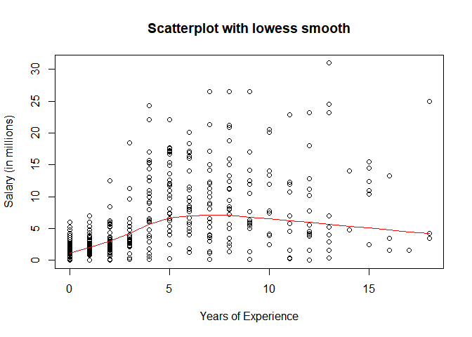
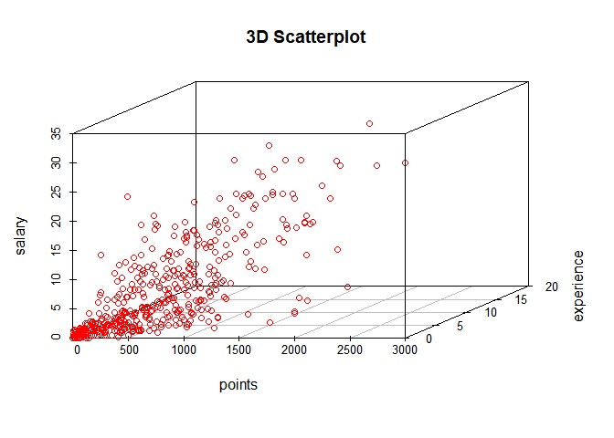
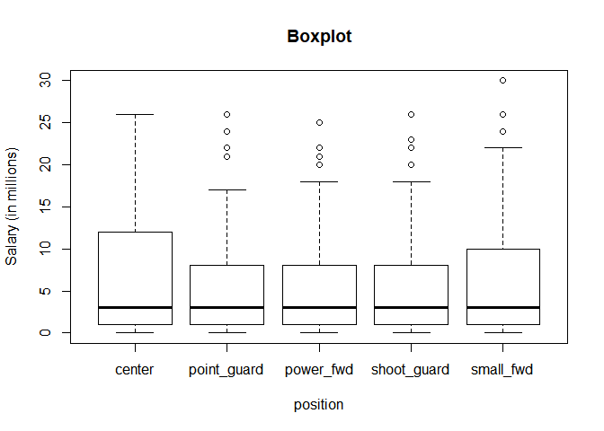

hw01-Gun-Kim
================
Gun Yeup Kim
2017 9 22

``` r
  #load data file
  load("nba2017-salary-points.RData")
```

1. A bit of data preprocessing
==============================

``` r
  #Creating a new salary variable measured in millions of dollars, up to 2 decimal digits
  salary <- salary/1000000
  salary <- format(round(salary,2), nsmall =2)
  salary
```

    ##   [1] "26.54" "12.00" " 8.27" " 1.45" " 1.41" " 6.59" " 6.29" " 1.83"
    ##   [9] " 4.74" " 5.00" " 1.22" " 3.09" " 3.58" " 1.91" " 8.00" " 7.81"
    ##  [17] " 0.02" " 0.26" " 0.27" " 0.01" " 9.70" "12.80" " 1.55" " 0.54"
    ##  [25] "21.17" " 5.24" "17.64" "30.96" " 2.50" "15.33" " 1.59" " 7.33"
    ##  [33] " 1.58" "26.54" "14.20" " 0.54" " 2.70" "14.38" "12.00" " 1.92"
    ##  [41] " 0.87" " 5.30" " 1.20" " 6.05" "12.25" " 3.73" "22.12" " 1.20"
    ##  [49] " 1.19" " 0.54" "15.94" " 5.00" "16.96" "12.00" " 7.40" " 5.89"
    ##  [57] " 0.54" " 2.87" " 3.39" " 1.50" " 2.71" "23.18" " 8.40" " 0.39"
    ##  [65] "15.73" " 4.00" " 2.50" " 4.84" " 1.02" "20.07" " 0.42" " 3.85"
    ##  [73] " 2.28" " 3.00" "17.10" " 5.37" " 1.55" "12.52" "15.20" " 0.92"
    ##  [81] " 9.61" " 1.40" "10.50" " 1.81" " 6.35" " 2.57" " 2.37" " 2.70"
    ##  [89] "10.23" " 4.58" " 0.65" " 8.80" " 1.05" " 1.80" " 4.00" " 4.00"
    ##  [97] "10.77" " 2.46" "18.31" " 1.05" "14.15" " 3.49" " 1.45" " 2.11"
    ## [105] " 0.87" " 2.09" "23.20" " 1.02" " 1.64" "17.55" " 1.71" " 3.18"
    ## [113] " 5.78" " 0.75" "14.00" "13.22" " 2.90" "15.89" "22.12" " 4.00"
    ## [121] " 5.78" " 0.87" " 2.59" " 1.23" " 0.21" " 0.54" " 5.63" " 4.00"
    ## [129] " 6.00" " 1.02" "22.12" " 6.50" " 1.55" " 7.00" " 0.87" " 1.70"
    ## [137] " 6.00" "10.99" " 3.68" " 4.62" " 0.65" " 2.26" "14.96" " 2.97"
    ## [145] "17.20" " 1.05" " 0.10" " 0.87" " 5.32" " 2.73" " 6.51" " 0.16"
    ## [153] "12.00" " 6.33" "12.25" "13.00" "12.50" "20.87" " 6.00" " 0.54"
    ## [161] "24.56" " 0.14" "11.24" "21.32" "17.00" " 1.02" " 4.32" " 3.90"
    ## [169] " 6.19" " 0.54" " 0.54" " 2.90" " 0.54" " 1.41" " 1.38" " 4.35"
    ## [177] "17.00" " 5.00" " 7.25" " 0.98" " 2.61" "17.00" "15.00" " 6.54"
    ## [185] " 0.03" " 3.91" "11.75" " 0.03" " 0.95" "10.00" " 0.03" " 2.32"
    ## [193] " 9.00" " 4.79" " 9.42" " 4.83" " 1.51" " 2.99" " 1.03" " 1.02"
    ## [201] " 8.00" " 0.09" " 0.87" " 8.55" " 1.33" " 6.09" " 0.12" "21.17"
    ## [209] " 1.56" " 1.07" "11.48" " 0.98" " 3.00" " 3.33" " 1.79" " 2.50"
    ## [217] " 1.40" " 0.98" " 0.73" " 9.25" "11.13" " 1.17" " 1.55" "15.33"
    ## [225] " 1.02" " 0.98" " 1.40" "26.54" " 1.18" "16.66" " 0.38" " 0.54"
    ## [233] " 5.78" "12.11" " 2.90" " 0.54" "10.00" " 1.55" " 0.54" " 1.18"
    ## [241] " 2.90" " 0.17" " 0.87" "17.64" " 1.19" "20.58" "14.00" " 3.58"
    ## [249] "15.50" "14.45" " 0.68" " 0.54" " 1.30" "12.39" " 0.26" "26.54"
    ## [257] " 0.54" " 7.00" " 1.00" " 6.00" "18.74" " 1.72" " 7.81" " 0.15"
    ## [265] " 1.32" "11.00" "20.14" " 1.55" " 1.27" "22.87" "21.17" " 0.54"
    ## [273] " 7.38" "13.25" " 2.20" " 1.40" " 3.50" " 1.55" " 5.63" "10.15"
    ## [281] " 7.00" " 3.94" "11.05" " 8.00" "16.07" " 1.02" " 2.25" "11.00"
    ## [289] " 0.60" " 0.94" " 1.41" " 2.12" " 2.43" " 2.34" " 5.99" " 2.18"
    ## [297] " 2.44" " 2.48" "17.15" " 0.98" " 1.19" " 4.84" " 3.75" " 0.25"
    ## [305] "26.54" " 0.54" " 3.14" " 8.95" " 6.55" " 0.94" " 5.70" "22.12"
    ## [313] " 1.37" " 2.90" " 0.98" " 1.29" "21.17" "26.54" " 5.51" " 3.33"
    ## [321] " 4.26" " 1.79" " 0.08" "10.36" " 7.68" "18.50" " 3.22" "24.33"
    ## [329] " 6.67" "16.39" " 0.60" " 1.92" " 8.99" " 9.21" " 2.75" " 0.87"
    ## [337] " 1.35" " 0.54" "15.05" " 8.07" " 3.24" " 1.66" " 3.21" " 4.54"
    ## [345] " 1.99" "12.08" " 1.63" " 2.33" " 3.50" " 1.36" " 5.00" " 3.53"
    ## [353] "11.20" " 4.60" "22.12" " 0.02" " 0.54" " 2.98" "16.96" " 0.58"
    ## [361] " 8.08" " 0.17" "11.29" " 9.90" " 0.06" "11.24" " 2.09" " 0.65"
    ## [369] " 1.02" " 4.23" "25.00" " 0.54" " 8.38" "22.12" " 4.10" " 0.06"
    ## [377] " 4.38" " 0.54" " 0.87" " 2.90" "17.10" " 0.21" " 8.00" "12.50"
    ## [385] " 4.01" " 3.52" " 5.23" " 8.00" " 2.20" " 8.05" " 5.20" " 1.44"
    ## [393] "13.33" " 1.19" " 1.32" "10.66" " 3.55" " 2.02" " 6.01" " 3.50"
    ## [401] " 7.64" " 2.35" " 3.91" " 5.96" " 3.87" " 3.80" " 0.14" "13.55"
    ## [409] " 3.05" " 1.34" " 2.24" " 5.28" " 7.60" " 5.33" " 0.07" " 1.03"
    ## [417] "12.50" " 3.27" " 1.21" "18.00" " 1.55" " 5.44" " 6.19" " 1.05"
    ## [425] "16.00" " 1.73" " 0.87" " 4.82" "12.61" " 0.54" " 2.22" " 4.28"
    ## [433] " 0.02" "14.00" "10.47" " 4.00" " 2.94" " 0.28" " 2.13" " 0.92"
    ## [441] "12.41"

``` r
  #Replace R to 0
  experience <- replace(experience, experience == "R",0)
  experience <- as.integer(experience)
  experience
```

    ##   [1]  9 11  6  0  9  5  4  2  0  6  1  3  2  1  4 10 12 11  5  1  5 12 13
    ##  [24]  0  8 13  5 13 15  5  2  5  1  7  7  0  0  4 10  2  1  5  0  6  7  2
    ##  [47]  4  7  1  0  8  8  6  9  5  3  0  0  3  0  3 12  8 11  4 12  0 14  3
    ##  [70] 10  3 10  3  3  6  2 17  4  4  0  3  8  4  1  9  0  3  8 12 11  0  7
    ##  [93]  1  6  6  5 11  1  6  1  9  8  1  1  1  0 13  3  1  5  2  3  2  0 10
    ## [116]  8  4  8  4  7  9  1  1  6  0  0  2 13  7  1  4  4 12  1  1  0  6  5
    ## [139]  3  5  0  3  5  1  5  4  1  1  3  1  4  2  5  9 11  4  4  8  9  0 13
    ## [162]  0  8  7  9  3  1  4  5  0  0  0  0  9  0  2  5  9  8  2  2  4  8  7
    ## [185]  0  1  5  0  0  4  0  0  7  1  8  0  1  2  1  3  4  0  1  6  0  4  3
    ## [208]  8  0  0  6  2  2  2  4 10  1  2  2  6 12  0 13  4  3  2  8  9  1  5
    ## [231] 13  0 11  7 13  0  7 11  0  0  3  9  1  5  2 10 14  7 15 15  2  0  2
    ## [254]  8  0  7  0 11  1  4  8  1 12  0  7  4  6 11  0 11  8  0 10 16  8  8
    ## [277] 18 11  6  5 13  1  6  8  6  3  2 15  0  1  2  3  5  1  0  3  0  2  5
    ## [300]  2  1  4 12  5  8  0  3  7  3  0  8  5  0  2  2  1  8  9 12  3 18  0
    ## [323]  0 15  6  3  3  4  6  6  0  2  4  4  2  1  2  0  7  7  1  2  0 12  0
    ## [346]  5  0  3 16  1  8  4  8  6  4  1  0  7  6  4  5  4  7  6  0  3  2  0
    ## [369]  3 12 18  0  2  4 10  0  2  0  1  3  7  0  8  9  3  0  7  6  0  8  2
    ## [392]  0 10  0  7  7  1  2  2  8  6  3  7  1  0  1  7  5  3  1  2  0  9  1
    ## [415]  0  0  2  2  1 12 16  9  2  4  6  2  1  3  5  0  1  0  2  6  9 13  0
    ## [438] 11  2  0 15

``` r
  #Creating new position variable as an R factor with more decriptive labels
  position <- replace(position,position == "C", 'center')
  position <- replace(position,position == "SF", 'small_fwd')
  position <- replace(position,position == "PF", 'power_fwd')
  position <- replace(position,position == "SG", 'shoot_guard')
  position <- replace(position,position == "PG", 'point_guard')
  position <- as.factor(position)
    position
```

    ##   [1] center      power_fwd   shoot_guard point_guard small_fwd  
    ##   [6] point_guard small_fwd   shoot_guard small_fwd   power_fwd  
    ##  [11] power_fwd   center      shoot_guard point_guard center     
    ##  [16] center      small_fwd   point_guard power_fwd   center     
    ##  [21] shoot_guard shoot_guard small_fwd   point_guard power_fwd  
    ##  [26] shoot_guard point_guard small_fwd   small_fwd   center     
    ##  [31] small_fwd   shoot_guard point_guard shoot_guard small_fwd  
    ##  [36] point_guard center      center      point_guard center     
    ##  [41] shoot_guard small_fwd   power_fwd   power_fwd   power_fwd  
    ##  [46] small_fwd   shoot_guard point_guard power_fwd   center     
    ##  [51] center      center      point_guard center      power_fwd  
    ##  [56] small_fwd   shoot_guard shoot_guard point_guard small_fwd  
    ##  [61] point_guard center      power_fwd   point_guard small_fwd  
    ##  [66] power_fwd   point_guard small_fwd   center      power_fwd  
    ##  [71] power_fwd   small_fwd   shoot_guard small_fwd   center     
    ##  [76] power_fwd   shoot_guard center      small_fwd   shoot_guard
    ##  [81] point_guard power_fwd   power_fwd   shoot_guard power_fwd  
    ##  [86] center      shoot_guard point_guard center      small_fwd  
    ##  [91] power_fwd   point_guard point_guard power_fwd   shoot_guard
    ##  [96] power_fwd   shoot_guard center      small_fwd   power_fwd  
    ## [101] power_fwd   shoot_guard power_fwd   point_guard center     
    ## [106] shoot_guard shoot_guard shoot_guard point_guard small_fwd  
    ## [111] center      point_guard power_fwd   small_fwd   point_guard
    ## [116] center      shoot_guard point_guard center      power_fwd  
    ## [121] power_fwd   shoot_guard small_fwd   small_fwd   power_fwd  
    ## [126] shoot_guard point_guard center      shoot_guard center     
    ## [131] center      center      point_guard center      shoot_guard
    ## [136] power_fwd   point_guard power_fwd   shoot_guard small_fwd  
    ## [141] shoot_guard small_fwd   point_guard small_fwd   power_fwd  
    ## [146] point_guard point_guard power_fwd   power_fwd   center     
    ## [151] shoot_guard power_fwd   point_guard shoot_guard power_fwd  
    ## [156] small_fwd   center      shoot_guard point_guard shoot_guard
    ## [161] small_fwd   point_guard shoot_guard point_guard center     
    ## [166] shoot_guard power_fwd   center      power_fwd   center     
    ## [171] power_fwd   small_fwd   shoot_guard shoot_guard center     
    ## [176] small_fwd   center      point_guard point_guard small_fwd  
    ## [181] point_guard shoot_guard power_fwd   shoot_guard shoot_guard
    ## [186] small_fwd   center      shoot_guard center      small_fwd  
    ## [191] power_fwd   power_fwd   shoot_guard center      point_guard
    ## [196] center      small_fwd   shoot_guard center      small_fwd  
    ## [201] point_guard center      point_guard center      small_fwd  
    ## [206] power_fwd   shoot_guard center      small_fwd   point_guard
    ## [211] point_guard shoot_guard center      small_fwd   power_fwd  
    ## [216] shoot_guard small_fwd   shoot_guard point_guard power_fwd  
    ## [221] small_fwd   center      center      power_fwd   shoot_guard
    ## [226] power_fwd   center      small_fwd   center      shoot_guard
    ## [231] small_fwd   shoot_guard point_guard point_guard center     
    ## [236] shoot_guard shoot_guard power_fwd   power_fwd   point_guard
    ## [241] center      center      shoot_guard small_fwd   shoot_guard
    ## [246] power_fwd   shoot_guard point_guard center      point_guard
    ## [251] point_guard center      center      shoot_guard point_guard
    ## [256] point_guard power_fwd   shoot_guard center      shoot_guard
    ## [261] power_fwd   small_fwd   small_fwd   small_fwd   small_fwd  
    ## [266] shoot_guard power_fwd   power_fwd   power_fwd   point_guard
    ## [271] center      center      shoot_guard shoot_guard small_fwd  
    ## [276] center      small_fwd   point_guard small_fwd   shoot_guard
    ## [281] power_fwd   point_guard power_fwd   point_guard small_fwd  
    ## [286] center      small_fwd   small_fwd   power_fwd   point_guard
    ## [291] shoot_guard center      point_guard power_fwd   shoot_guard
    ## [296] small_fwd   power_fwd   small_fwd   center      small_fwd  
    ## [301] power_fwd   small_fwd   power_fwd   point_guard point_guard
    ## [306] point_guard center      power_fwd   shoot_guard point_guard
    ## [311] power_fwd   small_fwd   center      small_fwd   power_fwd  
    ## [316] power_fwd   center      point_guard shoot_guard shoot_guard
    ## [321] small_fwd   point_guard shoot_guard power_fwd   small_fwd  
    ## [326] shoot_guard shoot_guard point_guard power_fwd   small_fwd  
    ## [331] small_fwd   center      small_fwd   power_fwd   power_fwd  
    ## [336] shoot_guard point_guard shoot_guard small_fwd   power_fwd  
    ## [341] point_guard shoot_guard shoot_guard point_guard power_fwd  
    ## [346] power_fwd   shoot_guard center      small_fwd   center     
    ## [351] center      shoot_guard small_fwd   center      center     
    ## [356] small_fwd   power_fwd   small_fwd   center      power_fwd  
    ## [361] shoot_guard shoot_guard point_guard center      point_guard
    ## [366] small_fwd   point_guard center      shoot_guard point_guard
    ## [371] power_fwd   power_fwd   center      power_fwd   point_guard
    ## [376] power_fwd   center      small_fwd   center      point_guard
    ## [381] shoot_guard point_guard power_fwd   shoot_guard shoot_guard
    ## [386] shoot_guard point_guard shoot_guard center      center     
    ## [391] point_guard shoot_guard small_fwd   power_fwd   point_guard
    ## [396] small_fwd   center      power_fwd   small_fwd   shoot_guard
    ## [401] center      power_fwd   center      center      point_guard
    ## [406] power_fwd   small_fwd   point_guard small_fwd   point_guard
    ## [411] shoot_guard small_fwd   small_fwd   point_guard shoot_guard
    ## [416] center      shoot_guard power_fwd   power_fwd   small_fwd  
    ## [421] small_fwd   shoot_guard center      power_fwd   center     
    ## [426] point_guard center      center      shoot_guard small_fwd  
    ## [431] shoot_guard power_fwd   shoot_guard point_guard power_fwd  
    ## [436] shoot_guard power_fwd   point_guard small_fwd   point_guard
    ## [441] center     
    ## Levels: center point_guard power_fwd shoot_guard small_fwd

``` r
  #Computing the frequencies for position
  position_frequencies <- table(position)
  position_frequencies
```

    ## position
    ##      center point_guard   power_fwd shoot_guard   small_fwd 
    ##          89          85          89          95          83

2. Scatterplot of Points and Salary
===================================

`r   plot(points, salary, col = "red", xlab = "Points", ylab = "Salary (in millions)", main = "Scatterplot of Points and Salary")`



3. Correlation between Points and Salary
========================================

``` r
  #Creating all the variable to calculate Correlation between Points and Salary
  n <- 441
  mean_points <-  sum(points)/n
  int_salary <- as.integer(salary)
  mean_salary <- sum(int_salary)/n
  #Variance for points
  sample_minus_mean_points <- (points - mean_points)^2
  var_points <- sum(sample_minus_mean_points)/(n-1)
  #Variance for salary
  sample_minus_mean_salary <- (int_salary - mean_salary)^2
  var_salary <- sum(sample_minus_mean_salary)/(n-1)
  #Standard Deviation for points
  sd_points <- sqrt(var_points)
  #Standard Deviation for salary
  sd_salary <- sqrt(var_salary)
  #Covariance
  joint_points_salary <- (points - mean_points)*(int_salary-mean_salary)
  cov_points_salary <- sum(joint_points_salary)/(n-1)
  #Correlation bewtween points and salary
  corr_points_salary <- cov_points_salary/(sd_points*sd_salary)
  mean_points
```

    ## [1] 546.6054

``` r
  mean_salary
```

    ## [1] 5.773243

``` r
  var_points
```

    ## [1] 239136.2

``` r
  var_salary
```

    ## [1] 43.69846

``` r
  sd_points
```

    ## [1] 489.0156

``` r
  sd_salary
```

    ## [1] 6.610481

``` r
  cov_points_salary
```

    ## [1] 2050.288

``` r
  corr_points_salary
```

    ## [1] 0.6342478

4.Simple Linear Regression
==========================

``` r
  # slope
  b1 <- corr_points_salary * sd_salary/sd_points
  b0 <- mean_salary - b1*mean_points
  y_hat <- b0 + b1*points
  y_hat
```

    ##   [1]  9.248983  5.545135  8.751707  1.172537  3.333115 19.940414  9.651948
    ##   [8]  1.669813  5.502266  3.650342  1.412601  6.899783  8.245857  4.602026
    ##  [15]  2.612922  6.882636  1.163963  2.621496  2.424300  1.138242  5.948100
    ##  [22]  4.096176  2.218531  2.510037 10.877990  4.284798 16.656678 17.839852
    ##  [29]  4.927827  6.488244  1.206832  7.431354  2.372858 18.405718  6.556834
    ##  [36]  2.004188  2.501464  9.308999 12.609882  3.255951  6.539687  2.278547
    ##  [43]  3.050182  4.902106  3.890407  3.916128 16.339451  1.781271  1.095373
    ##  [50]  1.292569  2.570054  4.687763 16.562367  8.657396 10.200666 10.303551
    ##  [57]  1.858435  2.407153  3.530310  1.952746 13.210042  9.677669  3.401705
    ##  [64]  1.609797  7.954351  3.290246  4.439125  2.535759  4.816369 11.769657
    ##  [71]  1.301143  4.893532 10.886564 16.793858  9.240409  9.874864  3.718932
    ##  [78]  4.447699  4.739205  7.662844  6.033837  5.613725  4.953548  2.304268
    ##  [85]  1.798419  3.024461  6.942652  3.847538  5.673741  8.074383  1.266848
    ##  [92] 11.838247  1.669813  3.075903  1.455470  2.604348  6.488244 11.143775
    ##  [99] 16.305156  1.592649  8.065809  1.438322  4.833516  1.549781  3.796096
    ## [106]  3.581753 10.483599  2.638643  4.259077 16.656678  1.849861  3.633195
    ## [113]  7.465649  3.144493  5.699462  8.280152  7.337043 13.801629 12.309801
    ## [120]  9.446178  2.004188  5.708036  2.767249  3.864686  1.927024  5.347939
    ## [127]  9.677669  1.352585  6.642571  4.293372 10.560762  4.216208  3.033035
    ## [134]  2.724381  2.175662  1.601223  7.585681  7.662844 10.063486 10.560762
    ## [141]  1.121095  2.295694  7.534238  3.993291 12.412686  2.304268  1.515486
    ## [148]  1.386880  6.565408  8.580232  6.256754  1.241127 16.776710  7.774303
    ## [155]  8.365889  7.457075  1.352585 11.066612  3.761801  1.575502 15.310604
    ## [162]  1.901303  8.245857 10.980875  3.075903  6.479671 11.340971  5.339366
    ## [169]  3.444573  1.429749  1.927024  4.730631  2.930150  2.149941  6.119574
    ## [176]  9.823422  5.227907  3.496015  6.368212  1.789845 10.054913 11.092333
    ## [183]  6.556834  3.890407  1.206832  3.804669 10.483599  1.086800  1.283995
    ## [190]  3.650342  1.635518 10.003470  6.762603  6.145295  1.369733  6.462523
    ## [197]  2.827265  7.568533  5.879510  8.494495  5.630872  2.355711  5.853789
    ## [204]  1.421175  4.902106  1.344011  1.901303 14.281757  5.099301  5.742331
    ## [211]  5.570856  4.756353  4.876385  2.167089  2.878708  4.147618  6.874062
    ## [218]  8.966050  4.790647  7.165568  6.008116  1.249700  3.796096  7.740008
    ## [225]  5.605151  2.347137  5.133596 14.418937  2.244252 16.022223  2.064204
    ## [232]  3.504589  4.421977 18.225669  4.739205  1.892730  5.347939  6.025263
    ## [239]  3.684637  2.201384  4.404830  1.301143  5.227907 17.273986  3.195935
    ## [246] 11.743936  5.519414  7.594254  7.877187  6.556834  1.618370  1.206832
    ## [253]  8.100104 11.521019  1.112521 21.286488  1.198258  4.027586  5.605151
    ## [260]  6.565408  9.480473  5.407955  9.111803  1.584076  1.824140  8.708838
    ## [267] 12.369817  3.590326  1.121095 10.552188  9.909159  1.172537 11.143775
    ## [274]  9.729111  5.236481  7.182716  1.781271  5.699462  2.681512  3.513163
    ## [281]  3.984718  4.619173  5.167891  8.194415 14.813328  2.338563  6.068132
    ## [288]  7.217011  1.275422  1.944172  7.499944 10.835121  4.773500  4.859237
    ## [295]  4.567731  5.562282  5.193612  2.329989  9.943454  4.696337  1.206832
    ## [302]  1.841287  1.369733  1.455470 23.018380  2.655791  8.846018  2.861560
    ## [309] 10.234961  4.730631  2.707233  2.887281  1.584076  4.764926  6.994094
    ## [316]  2.501464 13.484401 13.218616  6.599703  5.810920  6.111001  1.995614
    ## [323]  1.558354  9.900586  5.648020  8.331595 16.836726 18.440012  2.801544
    ## [330]  6.111001  1.755550  3.693211  7.714287  4.524862  3.890407  1.927024
    ## [337]  2.955871  1.352585 10.903711  3.333115  6.256754  8.383037  8.040088
    ## [344]  6.976946  3.701785  6.119574  1.798419  3.187362  1.326864 11.555314
    ## [351]  1.121095  8.117251 10.663647  2.861560 19.083042  1.181111  1.832713
    ## [358]  4.816369  4.636320  2.372858  7.088405  3.375983  9.909159  1.815566
    ## [365]  1.532633  5.913805  5.065007  1.498338  1.155389  4.833516  7.679992
    ## [372]  4.087602  5.510840 14.101709  4.353388  1.429749  2.698659  2.372858
    ## [379]  2.913002  8.786002  9.540489  4.584878  5.039285  5.502266  5.330792
    ## [386]  4.327666  8.803149  5.425103  2.149941  5.116449  2.064204  1.764124
    ## [393]  5.905231  3.564605  6.925504  2.484316  6.325344  1.626944 17.659804
    ## [400]  2.775823  1.987040  8.082957  1.189684 18.757240  3.598900  4.542010
    ## [407]  1.472617  8.254431  7.705713  2.878708  8.708838  7.431354  2.192810
    ## [414]  9.523342  2.115646  3.521737 11.418134  9.446178  4.936401  4.730631
    ## [421]  1.575502  7.868614  4.370535  3.153067  4.524862  2.544332  4.053307
    ## [428]  6.342491  6.188164  2.527185 15.885043  2.338563  1.112521 13.004273
    ## [435]  4.807795  4.679189  7.542812  1.206832  9.240409  4.893532  4.490567

``` r
  summary(y_hat)
```

    ##    Min. 1st Qu.  Median    Mean 3rd Qu.    Max. 
    ##   1.087   2.424   4.791   5.773   7.774  23.018

'r y'

Interpreting slope Coefficient
==============================

B1 represents the difference in the predicted value of Y for each one-unit difference in B1.
============================================================================================

Interpreting the intercept
==========================

B0 can be interpreted as the value when you would predict for Y if b1 = 0
=========================================================================

``` r
  #predicted salary for 0,100,500,1000, 2000
  x <- c(0,100,500,1000,2000)
  Y_hat2 <- b0 + b1*x
  Y_hat2
```

    ## [1]  1.086800  1.944172  5.373661  9.660521 18.234243

5. Plotting the regression line
===============================

``` r
require(stats)  
plot(points, salary, col = "black", xlab = "Points", ylab = "Salary (in millions)", main = "Scatterplot of Points and Salary")+
  abline(a = 1.08679969, b = 0.00857372168, col = "blue")+ text(2450,19,"Regression",pch = 1, cex = 1, col = "blue")+
  lines(lowess(points, salary), col = "red")+text(2250, 28, "lowess",pch =1, cex = 1, col = "red")
```



    ## integer(0)

6. Regression residuals and Coefficient of Determination
========================================================

``` r
  #vector of residuals
  residuals_y <- int_salary - y_hat
  summary(residuals_y)
```

    ##    Min. 1st Qu.  Median    Mean 3rd Qu.    Max. 
    ## -13.940  -2.811  -1.181   0.000   2.647  19.113

``` r
  #RSS
  rss <- sum(residuals_y^2)
  rss
```

    ## [1] 11492.74

``` r
  #TSS
  tss <- sum((int_salary - mean_salary)^2)
  tss
```

    ## [1] 19227.32

``` r
  #R-square
  r_square <- 1-(rss/tss)
  r_square
```

    ## [1] 0.4022703

7. Exploring Position and Experience
====================================

``` r
  plot(experience, salary, col = "black",xlab = "Years of Experience", ylab = "Salary (in millions)" , main = "Scatterplot with lowess smooth") + lines(lowess(experience,salary), col = "red")
```



    ## integer(0)

``` r
 #scatterplot3d
  require(scatterplot3d)
```

    ## Loading required package: scatterplot3d

``` r
  scatterplot3d(points, experience, salary, color = "red", main = "3D Scatterplot")
```



Experience and Salary do related to each other
==============================================

``` r
  # boxplot
  factor_salary <- as.factor(salary)
  boxplot(int_salary ~ position, data = position, xlab = "position", ylab = "Salary (in millions)", main = "Boxplot")
```



Since medians for all of the position look similar, I believe salary and position are not much related to each other.
=====================================================================================================================

8. Comments and Reflections
===========================

1. Most of problems were workable; however, I still do not get the inline code
==============================================================================

2. plotting different plots was easy
====================================

3. It is nice but still confusing
=================================

4. Same as Number 3
===================

5. Yes, I did need help. I got helped from Internet sources
===========================================================

6. It took about 4 to 5 hours
=============================

7. For me, it was a inline code
===============================

8. Inline code
==============

9. Not that much.
=================

10. It was exciting. I feel proud of completing this assignment by myself.
==========================================================================
