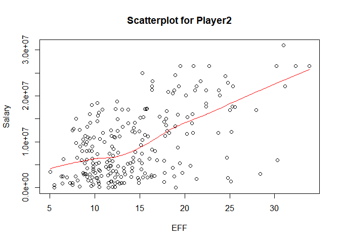

hw02-Gun-Kim
================
Gun Yeup Kim
2017년 10월 1일

``` r
  install.packages(c("dplyr","readr"),repos = "http://cran.us.r-project.org")
```

    ## Installing packages into 'C:/Users/Gun Yeup Kim/Documents/R/win-library/3.4'
    ## (as 'lib' is unspecified)

    ## package 'dplyr' successfully unpacked and MD5 sums checked
    ## package 'readr' successfully unpacked and MD5 sums checked
    ## 
    ## The downloaded binary packages are in
    ##  C:\Users\Gun Yeup Kim\AppData\Local\Temp\RtmpaGwwes\downloaded_packages

``` r
library(dplyr)
```

    ## Warning: package 'dplyr' was built under R version 3.4.2

    ## 
    ## Attaching package: 'dplyr'

    ## The following objects are masked from 'package:stats':
    ## 
    ##     filter, lag

    ## The following objects are masked from 'package:base':
    ## 
    ##     intersect, setdiff, setequal, union

``` r
library(readr)
```

    ## Warning: package 'readr' was built under R version 3.4.2

2. Import the data in R
=======================

``` r
  dat <- read.csv('nba2017-player-statistics.csv',colClasses = c(Position = "factor", Salary = "double"), stringsAsFactors = FALSE)
  str(dat)
```

    ## 'data.frame':    441 obs. of  24 variables:
    ##  $ Player      : chr  "Al Horford" "Amir Johnson" "Avery Bradley" "Demetrius Jackson" ...
    ##  $ Team        : chr  "BOS" "BOS" "BOS" "BOS" ...
    ##  $ Position    : Factor w/ 5 levels "C","PF","PG",..: 1 2 5 3 4 3 4 5 4 2 ...
    ##  $ Experience  : chr  "9" "11" "6" "R" ...
    ##  $ Salary      : num  26540100 12000000 8269663 1450000 1410598 ...
    ##  $ Rank        : int  4 6 5 15 11 1 3 13 8 10 ...
    ##  $ Age         : int  30 29 26 22 31 27 26 21 20 29 ...
    ##  $ GP          : int  68 80 55 5 47 76 72 29 78 78 ...
    ##  $ GS          : int  68 77 55 0 0 76 72 0 20 6 ...
    ##  $ MIN         : int  2193 1608 1835 17 538 2569 2335 220 1341 1232 ...
    ##  $ FGM         : int  379 213 359 3 95 682 333 25 192 114 ...
    ##  $ FGA         : int  801 370 775 4 232 1473 720 58 423 262 ...
    ##  $ Points3     : int  86 27 108 1 39 245 157 12 46 45 ...
    ##  $ Points3_atts: int  242 66 277 1 111 646 394 35 135 130 ...
    ##  $ Points2     : int  293 186 251 2 56 437 176 13 146 69 ...
    ##  $ Points2_atts: int  559 304 498 3 121 827 326 23 288 132 ...
    ##  $ FTM         : int  108 67 68 3 33 590 176 6 85 26 ...
    ##  $ FTA         : int  135 100 93 6 41 649 217 9 124 37 ...
    ##  $ OREB        : int  95 117 65 2 17 43 48 6 45 60 ...
    ##  $ DREB        : int  369 248 269 2 68 162 367 20 175 213 ...
    ##  $ AST         : int  337 140 121 3 33 449 155 4 64 71 ...
    ##  $ STL         : int  52 52 68 0 9 70 72 10 35 26 ...
    ##  $ BLK         : int  87 62 11 0 7 13 23 2 18 17 ...
    ##  $ TO          : int  116 77 88 0 25 210 79 4 68 39 ...

``` r
dat2 <- read_csv('nba2017-player-statistics.csv', col_types = list(Position = col_factor(levels = NULL)))
str(dat2)
```

    ## Classes 'tbl_df', 'tbl' and 'data.frame':    441 obs. of  24 variables:
    ##  $ Player      : chr  "Al Horford" "Amir Johnson" "Avery Bradley" "Demetrius Jackson" ...
    ##  $ Team        : chr  "BOS" "BOS" "BOS" "BOS" ...
    ##  $ Position    : Factor w/ 5 levels "C","PF","SG",..: 1 2 3 4 5 4 5 3 5 2 ...
    ##  $ Experience  : chr  "9" "11" "6" "R" ...
    ##  $ Salary      : num  26540100 12000000 8269663 1450000 1410598 ...
    ##  $ Rank        : int  4 6 5 15 11 1 3 13 8 10 ...
    ##  $ Age         : int  30 29 26 22 31 27 26 21 20 29 ...
    ##  $ GP          : int  68 80 55 5 47 76 72 29 78 78 ...
    ##  $ GS          : int  68 77 55 0 0 76 72 0 20 6 ...
    ##  $ MIN         : int  2193 1608 1835 17 538 2569 2335 220 1341 1232 ...
    ##  $ FGM         : int  379 213 359 3 95 682 333 25 192 114 ...
    ##  $ FGA         : int  801 370 775 4 232 1473 720 58 423 262 ...
    ##  $ Points3     : int  86 27 108 1 39 245 157 12 46 45 ...
    ##  $ Points3_atts: int  242 66 277 1 111 646 394 35 135 130 ...
    ##  $ Points2     : int  293 186 251 2 56 437 176 13 146 69 ...
    ##  $ Points2_atts: int  559 304 498 3 121 827 326 23 288 132 ...
    ##  $ FTM         : int  108 67 68 3 33 590 176 6 85 26 ...
    ##  $ FTA         : int  135 100 93 6 41 649 217 9 124 37 ...
    ##  $ OREB        : int  95 117 65 2 17 43 48 6 45 60 ...
    ##  $ DREB        : int  369 248 269 2 68 162 367 20 175 213 ...
    ##  $ AST         : int  337 140 121 3 33 449 155 4 64 71 ...
    ##  $ STL         : int  52 52 68 0 9 70 72 10 35 26 ...
    ##  $ BLK         : int  87 62 11 0 7 13 23 2 18 17 ...
    ##  $ TO          : int  116 77 88 0 25 210 79 4 68 39 ...
    ##  - attr(*, "spec")=List of 2
    ##   ..$ cols   :List of 24
    ##   .. ..$ Player      : list()
    ##   .. .. ..- attr(*, "class")= chr  "collector_character" "collector"
    ##   .. ..$ Team        : list()
    ##   .. .. ..- attr(*, "class")= chr  "collector_character" "collector"
    ##   .. ..$ Position    :List of 3
    ##   .. .. ..$ levels    : NULL
    ##   .. .. ..$ ordered   : logi FALSE
    ##   .. .. ..$ include_na: logi FALSE
    ##   .. .. ..- attr(*, "class")= chr  "collector_factor" "collector"
    ##   .. ..$ Experience  : list()
    ##   .. .. ..- attr(*, "class")= chr  "collector_character" "collector"
    ##   .. ..$ Salary      : list()
    ##   .. .. ..- attr(*, "class")= chr  "collector_double" "collector"
    ##   .. ..$ Rank        : list()
    ##   .. .. ..- attr(*, "class")= chr  "collector_integer" "collector"
    ##   .. ..$ Age         : list()
    ##   .. .. ..- attr(*, "class")= chr  "collector_integer" "collector"
    ##   .. ..$ GP          : list()
    ##   .. .. ..- attr(*, "class")= chr  "collector_integer" "collector"
    ##   .. ..$ GS          : list()
    ##   .. .. ..- attr(*, "class")= chr  "collector_integer" "collector"
    ##   .. ..$ MIN         : list()
    ##   .. .. ..- attr(*, "class")= chr  "collector_integer" "collector"
    ##   .. ..$ FGM         : list()
    ##   .. .. ..- attr(*, "class")= chr  "collector_integer" "collector"
    ##   .. ..$ FGA         : list()
    ##   .. .. ..- attr(*, "class")= chr  "collector_integer" "collector"
    ##   .. ..$ Points3     : list()
    ##   .. .. ..- attr(*, "class")= chr  "collector_integer" "collector"
    ##   .. ..$ Points3_atts: list()
    ##   .. .. ..- attr(*, "class")= chr  "collector_integer" "collector"
    ##   .. ..$ Points2     : list()
    ##   .. .. ..- attr(*, "class")= chr  "collector_integer" "collector"
    ##   .. ..$ Points2_atts: list()
    ##   .. .. ..- attr(*, "class")= chr  "collector_integer" "collector"
    ##   .. ..$ FTM         : list()
    ##   .. .. ..- attr(*, "class")= chr  "collector_integer" "collector"
    ##   .. ..$ FTA         : list()
    ##   .. .. ..- attr(*, "class")= chr  "collector_integer" "collector"
    ##   .. ..$ OREB        : list()
    ##   .. .. ..- attr(*, "class")= chr  "collector_integer" "collector"
    ##   .. ..$ DREB        : list()
    ##   .. .. ..- attr(*, "class")= chr  "collector_integer" "collector"
    ##   .. ..$ AST         : list()
    ##   .. .. ..- attr(*, "class")= chr  "collector_integer" "collector"
    ##   .. ..$ STL         : list()
    ##   .. .. ..- attr(*, "class")= chr  "collector_integer" "collector"
    ##   .. ..$ BLK         : list()
    ##   .. .. ..- attr(*, "class")= chr  "collector_integer" "collector"
    ##   .. ..$ TO          : list()
    ##   .. .. ..- attr(*, "class")= chr  "collector_integer" "collector"
    ##   ..$ default: list()
    ##   .. ..- attr(*, "class")= chr  "collector_guess" "collector"
    ##   ..- attr(*, "class")= chr "col_spec"

3. Right afte importing the data
================================

``` r
  #Replacing Experience to integers
  dat$Experience <- replace(dat$Experience, dat$Experience == "R", 0)
  dat$Experience <- as.integer(dat$Experience)
  str(dat)
```

    ## 'data.frame':    441 obs. of  24 variables:
    ##  $ Player      : chr  "Al Horford" "Amir Johnson" "Avery Bradley" "Demetrius Jackson" ...
    ##  $ Team        : chr  "BOS" "BOS" "BOS" "BOS" ...
    ##  $ Position    : Factor w/ 5 levels "C","PF","PG",..: 1 2 5 3 4 3 4 5 4 2 ...
    ##  $ Experience  : int  9 11 6 0 9 5 4 2 0 6 ...
    ##  $ Salary      : num  26540100 12000000 8269663 1450000 1410598 ...
    ##  $ Rank        : int  4 6 5 15 11 1 3 13 8 10 ...
    ##  $ Age         : int  30 29 26 22 31 27 26 21 20 29 ...
    ##  $ GP          : int  68 80 55 5 47 76 72 29 78 78 ...
    ##  $ GS          : int  68 77 55 0 0 76 72 0 20 6 ...
    ##  $ MIN         : int  2193 1608 1835 17 538 2569 2335 220 1341 1232 ...
    ##  $ FGM         : int  379 213 359 3 95 682 333 25 192 114 ...
    ##  $ FGA         : int  801 370 775 4 232 1473 720 58 423 262 ...
    ##  $ Points3     : int  86 27 108 1 39 245 157 12 46 45 ...
    ##  $ Points3_atts: int  242 66 277 1 111 646 394 35 135 130 ...
    ##  $ Points2     : int  293 186 251 2 56 437 176 13 146 69 ...
    ##  $ Points2_atts: int  559 304 498 3 121 827 326 23 288 132 ...
    ##  $ FTM         : int  108 67 68 3 33 590 176 6 85 26 ...
    ##  $ FTA         : int  135 100 93 6 41 649 217 9 124 37 ...
    ##  $ OREB        : int  95 117 65 2 17 43 48 6 45 60 ...
    ##  $ DREB        : int  369 248 269 2 68 162 367 20 175 213 ...
    ##  $ AST         : int  337 140 121 3 33 449 155 4 64 71 ...
    ##  $ STL         : int  52 52 68 0 9 70 72 10 35 26 ...
    ##  $ BLK         : int  87 62 11 0 7 13 23 2 18 17 ...
    ##  $ TO          : int  116 77 88 0 25 210 79 4 68 39 ...

4. Performance of players
=========================

``` r
  #add variables
  Missed_FG <- dat$FGA - dat$FGM
  Missed_FT <- dat$FTA - dat$FTM
  Total_points <- 3*dat$Points3+2*dat$Points2+dat$FTM
  REB <- dat$OREB + dat$DREB
  Min_per_game <- dat$MIN/dat$GP
  EFF = (Total_points + REB + dat$AST + dat$STL + dat$BLK - Missed_FG - Missed_FT - dat$TO)/dat$GP
  dat <- cbind(dat, Missed_FG, Missed_FT,Total_points, REB, Min_per_game, EFF)
  summary(EFF)
```

    ##    Min. 1st Qu.  Median    Mean 3rd Qu.    Max. 
    ##  -0.600   5.452   9.090  10.137  13.247  33.840

``` r
  hist(EFF, main = "Histogram of Efficiency (EFF)", col = "gray")
```


``` r
  #Display the player name, team, salary, and EFF value of the top-10 players by EFF
  new_data_frame_top_10 <- dat[order(-dat$EFF),]
  new_data_frame_top_10 <- slice(new_data_frame_top_10,1:10)
  new_data_frame_top_10 <- select(new_data_frame_top_10, Player, Team, Salary, EFF)
  new_data_frame_top_10
```

    ## # A tibble: 10 x 4
    ##                   Player  Team   Salary      EFF
    ##                    <chr> <chr>    <dbl>    <dbl>
    ##  1     Russell Westbrook   OKC 26540100 33.83951
    ##  2          James Harden   HOU 26540100 32.34568
    ##  3         Anthony Davis   NOP 22116750 31.16000
    ##  4          LeBron James   CLE 30963450 30.97297
    ##  5    Karl-Anthony Towns   MIN  5960160 30.32927
    ##  6          Kevin Durant   GSW 26540100 30.19355
    ##  7 Giannis Antetokounmpo   MIL  2995421 28.37500
    ##  8      DeMarcus Cousins   NOP 16957900 27.94118
    ##  9          Jimmy Butler   CHI 17552209 25.60526
    ## 10      Hassan Whiteside   MIA 22116750 25.36364

``` r
  #provide the names of the players that have a negative EFF
  negative_EFF_Player <- filter(dat, EFF < 0)
  negative_EFF_Player
```

    ##            Player Team Position Experience Salary Rank Age GP GS MIN FGM
    ## 1 Patricio Garino  ORL       SG          0  31969   17  23  5  0  43   0
    ##   FGA Points3 Points3_atts Points2 Points2_atts FTM FTA OREB DREB AST STL
    ## 1   7       0            5       0            2   0   0    1    6   0   0
    ##   BLK TO Missed_FG Missed_FT Total_points REB Min_per_game  EFF
    ## 1   0  3         7         0            0   7          8.6 -0.6

``` r
  #compute the correlation coefficients between EFF and all the variables used in the EFF
  cor_Total_points <- cor(dat$Total_points, dat$EFF)
  cor_REB <- cor(dat$REB, dat$EFF)
  cor_STL <- cor(dat$STL, dat$EFF)
  cor_AST <- cor(dat$AST, dat$EFF)
  cor_BLK <- cor(dat$BLK, dat$EFF)
  cor_Missed_FT <- cor(dat$Missed_FT, dat$EFF)*(-1)
  cor_Missed_FG <- cor(dat$Missed_FG, dat$EFF)*(-1)
  cor_TO <- cor(dat$TO, dat$EFF)*(-1)
  
  data_frame_for_Correlation_EFF <- data.frame(c(PTS = cor_Total_points, REB = cor_REB, STL = cor_STL, AST = cor_AST, BLK = cor_BLK, Missed_FT = cor_Missed_FT, Missed_FG = cor_Missed_FG, TO = cor_TO))
  Correlation_EFF <- (c(cor_Total_points,cor_REB,cor_STL,cor_AST,cor_BLK,cor_Missed_FT, cor_Missed_FG, cor_TO))
  cols <- c("red", "gray")[(Correlation_EFF > 0)+1]
  barplot(Correlation_EFF, names.arg = c("PTS","REB","STL","AST","BLK","Missed_FT","Missed_FG","TO"), cex.names = 0.7, main = "Correlations between Player Stats and EFF", col = cols)
```


5. Efficiency and Salary
========================

``` r
  #Efficiency and Salary
  plot(dat$EFF, dat$Salary, main = "Scatterplot for Player2", xlab = "EFF", ylab = "Salary")+lines(lowess(dat$EFF,dat$Salary), col = "red")
```


    ## integer(0)

``` r
  cor(dat$EFF, dat$Salary)
```

    ## [1] 0.655624

Efficiency and salary are positivly correlated.
===============================================

``` r
  #Create another data frame for MPG >20
  players2 <- filter(dat, Min_per_game >20)
  plot(players2$EFF, players2$Salary)+lines(lowess(players2$EFF,players2$Salary), col ="red")
```



    ## integer(0)

``` r
  cor(players2$EFF, players2$Salary)
```

    ## [1] 0.5367224

This data frame also shows that efficiency and salary are positivly correlated but the correlation between these two are little bit smaller than all players' data.
===================================================================================================================================================================

6. Comments and Reflections
===========================

filtering was confusing because of NA
=====================================

ploting was easy because we did a lot of practice
=================================================

It took me about 4 hours
========================
