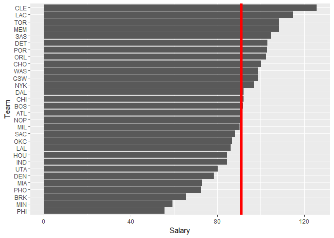
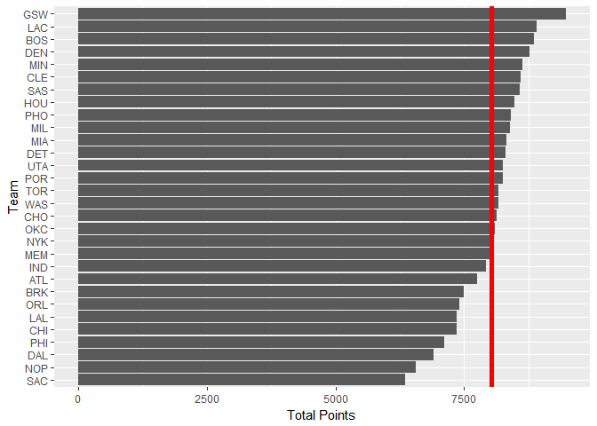
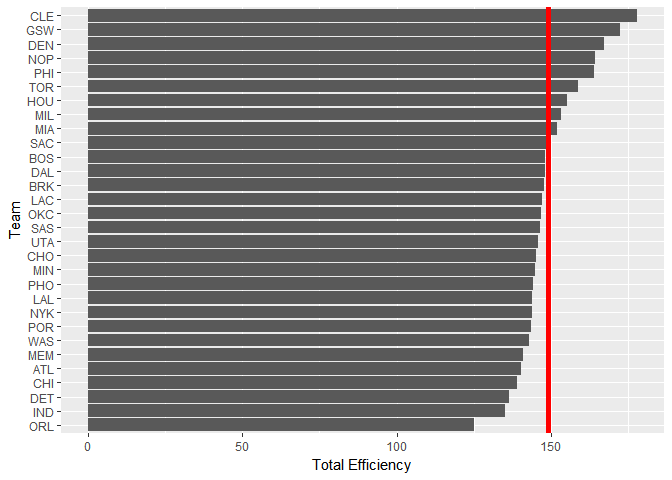
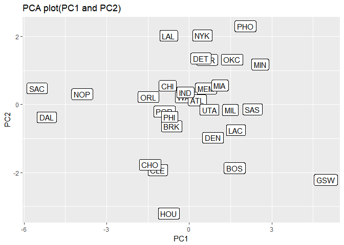
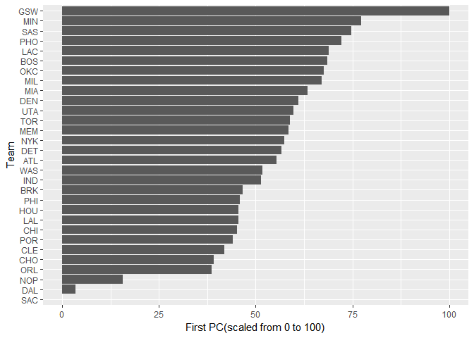

hw03
================
Gun Yeup Kim
2017 10 13

``` r
  library(ggplot2)
  library(dplyr)
```

    ## Warning: package 'dplyr' was built under R version 3.4.2

    ## 
    ## Attaching package: 'dplyr'

    ## The following objects are masked from 'package:stats':
    ## 
    ##     filter, lag

    ## The following objects are masked from 'package:base':
    ## 
    ##     intersect, setdiff, setequal, union

``` r
  #loading data
  teams <- read.csv("../data/nba2017-teams.csv")
```

``` r
  #arrange it by decreasing order.
  teams <- teams %>% arrange(desc(teams$salary))
```

``` r
  #plotting for team and salary
  ggplot(teams,aes(reorder(team, salary),salary))+geom_bar(stat = 'identity')+coord_flip() +xlab("Team")+ylab("Salary")+geom_hline(aes(yintercept = mean(salary)),color = "red",size =2)
```



``` r
  #plotting for team and total points
  ggplot(teams,aes(reorder(team, points),points))+geom_bar(stat = 'identity')+coord_flip() +xlab("Team")+ylab("Total Points")+geom_hline(aes(yintercept = mean(points)),color = "red",size =2)
```



``` r
  #plotting team and total efficiency
  ggplot(teams,aes(reorder(team, efficiency),efficiency))+geom_bar(stat = 'identity')+coord_flip() +xlab("Team")+ylab("Total Efficiency")+geom_hline(aes(yintercept = mean(efficiency)),color = "red",size =2)
```



``` r
  pca <- prcomp(~teams$points3+teams$points2+ teams$free_throws+teams$off_rebounds+teams$def_reounds+teams$assists+teams$steals+teams$blocks+ teams$turnovers+teams$fouls, scale. = TRUE)
eigen_value <- data.frame(eigenvalue = pca$sdev^2, prop = round(pca$sdev^2/sum(pca$sdev^2),4))
eigen_value <- eigen_value %>% mutate(cumprop = cumsum(eigen_value$prop))
```

``` r
pc <- data.frame(team = teams$team, pca$x[,1:2])
ggplot(pc, aes(-PC1, PC2, label = teams$team))+geom_point()+geom_label()+xlab("PC1")+labs(title ="PCA plot(PC1 and PC2)")
```



``` r
  rescaling_pc <- mutate(pc, rescale_pc1 = 100*(-PC1-min(-PC1))/(max(-PC1)-min(-PC1)))
  ggplot(rescaling_pc,aes(reorder(team, rescale_pc1),rescale_pc1))+geom_bar(stat = 'identity')+coord_flip() +xlab("Team")+ylab("First PC(scaled from 0 to 100)")
```



By using rescaled PC1, it looks like GSW team has 100 scale and SAC team has 0.
===============================================================================
