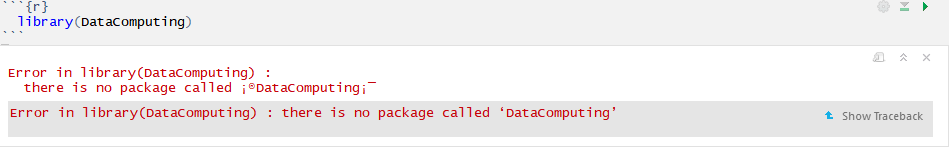
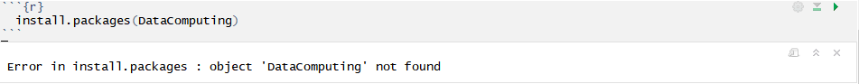
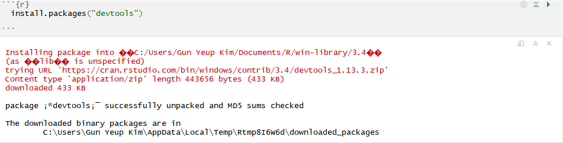
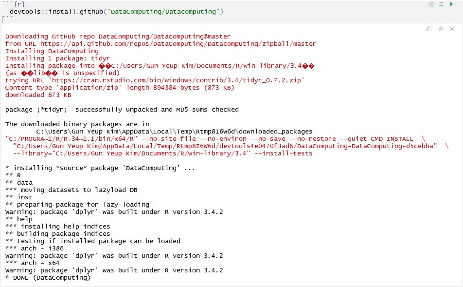

```{r setup, include=FALSE}
knitr::opts_chunk$set(echo = TRUE)
```
#Specify on example of data cleaning by using DataComputing and devtools packages.


#What is Data Manipulation?

Data manipulation is to clean and change data for users to make it easier to read or to use for their purposes. For example, when we want to organize the data by ages, we will need to use some skills in R to clean out the data by ages (We will go over those skills in this post later). Cleaning data does not mean that we have to get rid of the original data sets. we can create a new data frame and put all the necessary data in to new data frame. It would be better to keep the original data sets because we might use that original data to get another useful data sets.


#What are the DataComputing and devtools packages?

DataComputing package is written by Danny Kaplan, and when we type `?DataComputing` after downloading this package, we can see bunch of help pages in `Help` panel. Then go to `DESCRIPTION file` from the `Help` panel, we will see the description: ```Provides data tables used as examples in the Data Computing book and exercises, manipulate apps for getting started with ggplot, and assorted functions for reading data, drawing networks, and packaging Rmd sources in the html result.``` This description is basically saying that DataComputing package can read, plot, and manipulate data. We do not have to call other packages to manipulate and plot the data sets. DataComputing package will automatically load `ggplot2` and `dplyr` since those two packages are already built in under R version 3.4.2.

In order to download DataComputing package, we might need to use devtools package to install DataComputing package. Devtools package is the `tools to make developting R packages easier.` We do not have to use this package all the time, but we might need to use this package for installing DataComputing package. I will go over the reason while I show you how to download the DataComputing package!


In this post we will also go over how to manipulate the data sets that contain stock prices for Visa and MasterCard Inc. At the end, we want to see that if their movements of prices are similar enough to do a pairs trading (see [Pairs Trading](http://www.investopedia.com/university/guide-pairs-trading/) for more details. I will not go over this trading strategy since this is out of the topic).


#Downloading DataComputing package

Let's try downloading the DataComputing package as usual.

Type `library(DataComputing)` in to your chunk. You will get this error.



Then type `install.packages(DataComputing)` to install the package. You will also get this error.



These errors might happen to you because your R account is not up to date with the DataComputing package. This does not mean you cannot download this package! From here, devtools package comes in. 

First, we need to download devtools.



After installing this package, type `devtools::install_github("DataComputing/DataComputing")`. This might take some minutes depending on your internet speed.




Now, `library(DataComputing)` will work since we successfully install the DataComputing package.
```{r}
  library(DataComputing)
```


#Data Cleaning for Visa and MasterCard Inc.

Our data for Visa and MasterCard Inc. is in the data file. Let's go head and load our data to this R studio.

```{r}
  #loading the data
  V_MA <- read.csv("./data/v_ma.csv")
```


```{r}
  #Let's go over this data by using summary()
  summary(V_MA)
```

It is important to look and understand how the original data is formatted. When we look at the summary of this data, we can see that this data contains two `TICKER`. `MA` is MasterCard that has 2670 number of prices, and `V` is the Visa card that has 2214 number of prices. In order to compare two companies, we need to change and create a new variables. 

It will be easier for us to compare when the numbers of prices are same. Since `MA` did [IPO](http://www.investopedia.com/university/ipo/ipo.asp) first, it has more numbers of prices than `V`. So let's make those numbers same.

Here is the step:

1. Create a new data frame for Visa:`visa_card` and MasterCard:`master_card`.
2. Match up the number of prices. We can do this by using the `date` from the original data. Because the starting date of the Visa is `20080321`, we can filter the MasterCard's data to delete all the prices before `20080321`.
3. Create a new data frame `clean_data` for the date, price of Visa, and price of MasterCard. We only need these variables to compare. 

```{r}
  #Step 1
  master_card <- V_MA %>% filter(TICKER == "MA")
  visa_card <- V_MA %>% filter(TICKER == "V")
  #Step 2
  master_card <- master_card %>% filter(date >= visa_card$date[1])
  #step 3
  clean_data <- data.frame(Date = visa_card$date, V = visa_card$PRC, MA = master_card$PRC)
```

Try `head(clean_data)` to see if we have a data sets that we want to use. We should have date, price of visa and MasterCard. Also, plot the prices and see if they are similar.
```{r}
  head(clean_data)
  #Plotting the prices for Visa and MasterCard
  ggplot(clean_data, aes(x = Date))+
    geom_line(aes(y = V), colour = 'red')+
    geom_line(aes(y = MA), colour = 'blue')+
    ylab("Price") +
    annotate("text", x = 20125000, y = 800, label = "MasterCard")+
    annotate("text", x = 20150000, y = 300, label = "Visa")+
    ggtitle("Prices of Visa and MasterCard")
  
  
```


As we can see our plot `Prices of Visa and MasterCard` above, this data will not show us their movements of prices are similar. In order to see their movements, we have to get the percentages, which is the difference between one day and the previous of that one day. And both of Visa and MasterCard [splited](http://www.investopedia.com/ask/answers/113.asp), so we also need to scale differently for those dates. For visa, `2015-03-19` was the split day. For MasterCard, `2014-01-21` was the split day.

Let's change the MasterCard first. 

Here are 6 steps:

1. Use the `master_card` to create a new data frame with eliminating the first row by using slice.
2. select `PRC` from the new data frame to use when we calculate for the percentage.
3. Create another data frame with eliminating the last row by using slice.
4. Select `PRC` from the second data frame.
5. Formula for calculating percentage is (data from step 2 - data from step 4)/(data from step 4). 
6. Calculate separately for splitting date, which is `2014-01-21`. 

```{r}
  #step 1.
  eliminate_first_row_master <- data.frame(master_card %>% slice(2:nrow(master_card)))
  #step 2. 
  eliminate_first_row_master_price <- eliminate_first_row_master %>% select(PRC)
  #step 3.
  eliminate_last_row_master <- data.frame(master_card %>% slice(1:2213))
  #step 4. 
  eliminate_last_row_master_price <- eliminate_last_row_master %>% select(PRC)
  #Step 5. 
  MA_percentage <- (eliminate_first_row_master_price - eliminate_last_row_master_price)/eliminate_last_row_master_price
  #step 6. Since they splited 10 to 1, price of previous day should be divided by 10
  MA_1471 <- (eliminate_first_row_master_price$PRC[1471] - (eliminate_last_row_master_price$PRC[1471]/10))/(eliminate_last_row_master_price$PRC[1471]/10)
MA_percentage$PRC[1471] <- MA_1471
  head(MA_percentage)
```

Now, you should repeat above steps for Visa. The only difference between Visa and MasterCard is the split's date and the ratio.

```{r}
  #Visa_percentage
  
  #Step 1.
  eliminate_first_row_visa <- data.frame(visa_card %>% slice(2:nrow(visa_card)))
  #Step 2.
  eliminate_first_row_visa_price <- eliminate_first_row_visa %>% select(PRC)
  #Step 3.
  eliminate_last_row_visa <- data.frame(visa_card %>% slice(1:2213))
  #Step 4.
  eliminate_last_row_visa_price <- eliminate_last_row_visa %>% select(PRC)
  #Step 5.
  V_percentage <- (eliminate_first_row_visa_price - eliminate_last_row_visa_price)/eliminate_last_row_visa_price
  #Step 6. For visa, it is splited 4 to 1 on `2008-03-20`. We should divide the price of previous day of splited date by 4.
  V_1763 <- (eliminate_first_row_visa_price$PRC[1762] - (eliminate_last_row_visa_price$PRC[1762]/4))/(eliminate_last_row_visa_price$PRC[1762]/4)
V_percentage$PRC[1762] <- V_1763
head(V_percentage)
```

Now, we have both of MasterCard and Visa percentage. Let's go head and create a new data frame that contains `Data`, `Visa Percentage`, and `MasterCard Percentage`.

```{r}
  #Creating a new data frame for percentage data sets.
  V_MA_Percentage <- data.frame(Date = eliminate_first_row_master$date, V = V_percentage$PRC, MA = MA_percentage$PRC)
  colnames(V_MA_Percentage) <- c("Date","V_Percentage","MA_Percentage")
  head(V_MA_Percentage)
```

Then plot `V_MA_Percentage` by using ggplot again.

```{r}
  #Plotting visa and MasterCard's return percentage.
  ggplot(V_MA_Percentage, aes(x = Date))+
    geom_line(aes(y = V_Percentage), colour = 'red')+
    geom_line(aes(y = MA_Percentage), colour = 'blue')+
    ylab("Percentage") +
    annotate("text", x = 20135000, y = 0.15, label = "---- MasterCard", col = "blue")+
    annotate("text", x = 20150000, y = 0.15, label = "---- Visa", col = "red")+
    ggtitle("Returns of percentage for Visa and MasterCard")
```

`Returns of percentage for Visa and MasterCard` plot shows strong correlation between Visa and MasterCard. To confirm the strong correlation between two stocks, we can also use `cor()` function to check. 

```{r}
  #Correlation between Visa and MasterCard
  V_MA_Cor <- cor(V_MA_Percentage$V_Percentage, V_MA_Percentage$MA_Percentage)
  V_MA_Cor
```

Correlation between Visa and MasterCard is 0.7871862, which means that they are highly correlated. To use the Pairs Trading strategy, correlation should be around .80 or higher. Thus, Visa and MasterCard can be used to do the pairs trading. 

#Concluding the Post!
Finally, data manipulating is done by using DataComputing and devtools packages! Let's go over what we did in this post real quick.

1. We went over what the data manipulating is.
2. We noticed that loading just DataComputing will be fine to do data cleaning. (We only used `library(DataComputing)` in this post)
3. Since DataComputing has been added to R studio recently, we need to use devtools package to install DataComputing. 4. Using DataComputing package, we did the example of data manipulating by using data sets of Visa and MasterCard stock prices. 
5. We used `filter`, `slice`, `select`, `ggplot`, `cor`, and etc to manipulate the data to see if Visa and MasterCard can be used for pairs trading. 
6. Finally, we can conclude that Visa and MasterCard can be used for pairs trading by plotting and getting the strong correlation.

I hope my post shows you how to do the data cleaning by using DataComputing package and example!!!

#Reference
[R Documentation for devtools](https://cran.r-project.org/web/packages/devtools/README.html)

[Information about DataComputing in github](https://github.com/DataComputing/DataComputing)

[Instruction for downloading DataComputing package](http://www.mosaic-web.org/go/datasets/DCF/Excerpts/Review-Chap-02.pdf)

[Cheat Sheet for ggplot2](https://github.com/ucb-stat133/stat133-fall-2017/blob/master/cheat-sheets/ggplot2-cheatsheet-2.1.pdf)

[Information about Data Manipulation](https://www.computerhope.com/jargon/d/datamani.htm)

[Information about Data Manipulation 2](https://www.fda.gov/ohrms/dockets/dockets/06n0464/06N-0464-EC28-Attach-1.pdf)

[Data sets for visa and MasterCard](https://kseaproject.slack.com/files/U74JAM3B7/F7LC7L4UX/v_ma.csv)

[Instruction for uploading pictures in R studio](https://stackoverflow.com/questions/34345712/how-to-upload-an-image-into-rstudio-notebook)


