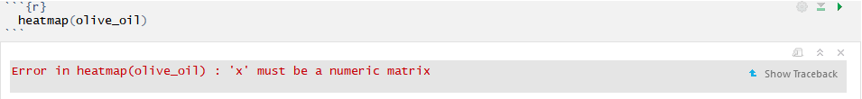
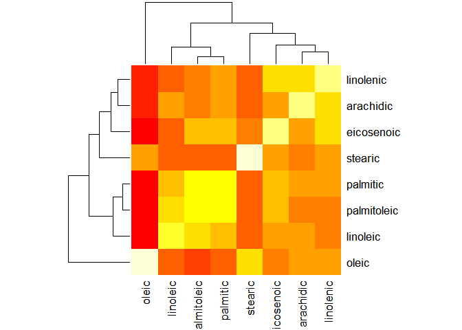
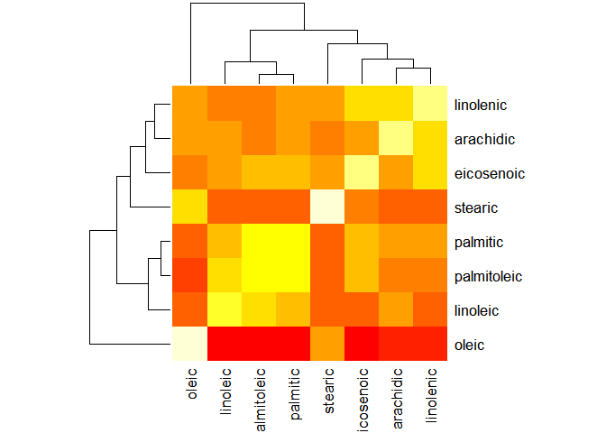
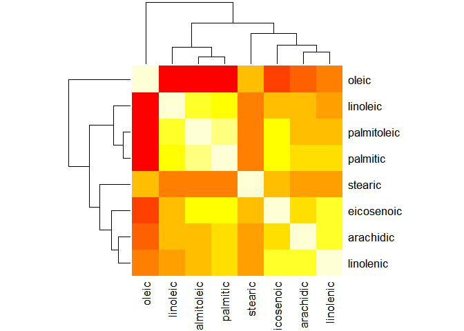
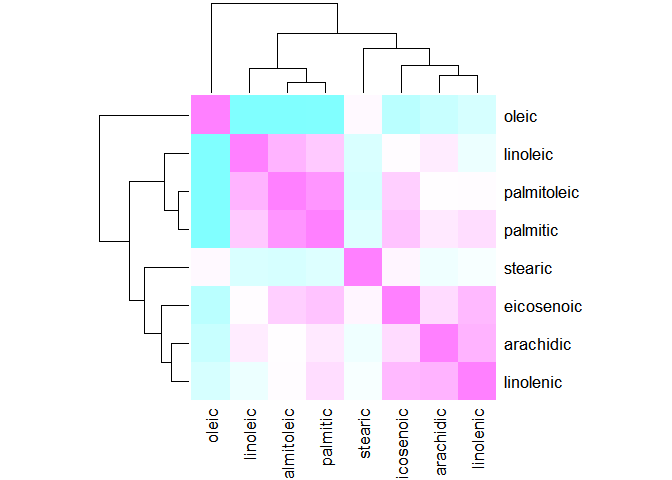
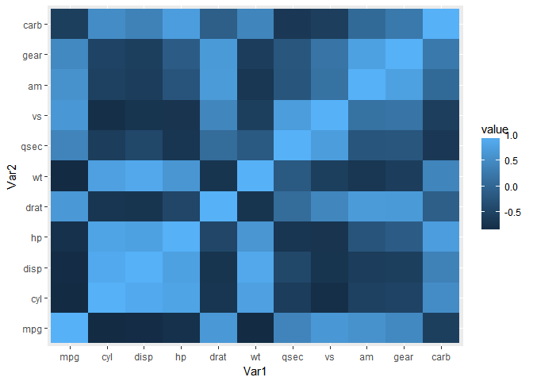
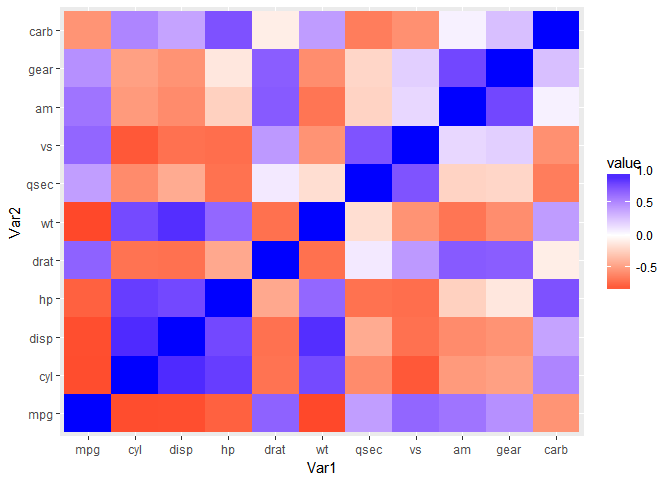

Post02-Heatmaps
================
Gun Yeup Kim
2017-12-1

Introducing Heatmaps in R
=========================

What is heatmap?
================

A heatmap is a graphical representation of data where the individual values contained in a matrix are represented as colors.The easy way to understand a heatmap is to think of a cross table or spreadsheet which contains colors instead of numbers. There are lots of benefits of using a heatmap. Users of heatmap can see up to 100,000 distinct elements on a single screen. They can find patterns, trends and allocations at a high level of granularity and also can find visually focus on what's relevant in their data by mapping important values to the size and color of elements. Furthermore, users can see a summary of the data while simultaneously viewing the details, enhancing communication between managers and their reports by allowing them to the same visualization when discussing issues. Basically, a heatmap is used to understand data visually.

This post will cover..
======================

-Data Preparation to create a heatmap

-Function `heatmap()`

-The other method to create a heatmap

What do we need to creat a heatmap
==================================

We obviously need some data sets to create a heatmap and also need the package `dplyr` to prepare the data. To use `heatmap()` function, we do not need to install any package or need to library the package. `heatmap()` is already built in R. Lastly, to create a heatmap by using other method (not using `heatmap()` function) such as using ggplot. In order to use ggplot, we need to install and library the `ggplot2`.

Data sets
=========

Before we create a heatmap let's go head and get the data. In this post we will use the data sets of olive oil. This data contains the percentages of each of eight fatty acids comprising olive oil across three regions of Italy which are further partitioned into a total of nine sub regions. I have attached the data in the file where this post is saved! I will also push the `oliveoil.txt` file to my github.

``` r
#library dplyr
library(dplyr)
```

    ## Warning: package 'dplyr' was built under R version 3.4.2

    ## 
    ## Attaching package: 'dplyr'

    ## The following objects are masked from 'package:stats':
    ## 
    ##     filter, lag

    ## The following objects are masked from 'package:base':
    ## 
    ##     intersect, setdiff, setequal, union

``` r
olive_oil <- read.table('oliveoil.txt', sep = ',', header = T)
str(olive_oil)
```

    ## 'data.frame':    572 obs. of  12 variables:
    ##  $ Obs        : int  1 2 3 4 5 6 7 8 9 10 ...
    ##  $ Label      : Factor w/ 9 levels "Calabria","Coast-Sardinia",..: 5 5 5 5 5 5 5 5 5 5 ...
    ##  $ Region     : int  1 1 1 1 1 1 1 1 1 1 ...
    ##  $ Area       : int  1 1 1 1 1 1 1 1 1 1 ...
    ##  $ palmitic   : int  1075 1088 911 966 1051 911 922 1100 1082 1037 ...
    ##  $ palmitoleic: int  75 73 54 57 67 49 66 61 60 55 ...
    ##  $ stearic    : int  226 224 246 240 259 268 264 235 239 213 ...
    ##  $ oleic      : int  7823 7709 8113 7952 7771 7924 7990 7728 7745 7944 ...
    ##  $ linoleic   : int  672 781 549 619 672 678 618 734 709 633 ...
    ##  $ linolenic  : int  36 31 31 50 50 51 49 39 46 26 ...
    ##  $ arachidic  : int  60 61 63 78 80 70 56 64 83 52 ...
    ##  $ eicosenoic : int  29 29 29 35 46 44 29 35 33 30 ...

As we can see the structure of our data, `olive_oil` is in data frame. When I tried to use heatmap function for `olive_oil` right away, I get this error message.



So we should make our data to numeric matrix. Let's make a correlation matrix between all other acids.

Here is the steps:

1.  We need to select acids from our data frame.
2.  Get the correlation by using `cor()`.
3.  Set that correlation table to matrix.

``` r
#Step 1
olive <- select(olive_oil, palmitic, palmitoleic,stearic,oleic,linoleic,linolenic,arachidic,eicosenoic)
#Step 2
cor(olive)
```

    ##               palmitic palmitoleic     stearic      oleic    linoleic
    ## palmitic     1.0000000  0.83560497 -0.17039178 -0.8373354  0.46068446
    ## palmitoleic  0.8356050  1.00000000 -0.22218545 -0.8524384  0.62162666
    ## stearic     -0.1703918 -0.22218545  1.00000000  0.1135987 -0.19781693
    ## oleic       -0.8373354 -0.85243835  0.11359873  1.0000000 -0.85031837
    ## linoleic     0.4606845  0.62162666 -0.19781693 -0.8503184  1.00000000
    ## linolenic    0.3193267  0.09311163  0.01891719 -0.2181712 -0.05743858
    ## arachidic    0.2282991  0.08548117 -0.04097892 -0.3199623  0.21097260
    ## eicosenoic   0.5019518  0.41635048  0.14037748 -0.4241459  0.08904499
    ##               linolenic   arachidic  eicosenoic
    ## palmitic     0.31932669  0.22829912  0.50195179
    ## palmitoleic  0.09311163  0.08548117  0.41635048
    ## stearic      0.01891719 -0.04097892  0.14037748
    ## oleic       -0.21817123 -0.31996234 -0.42414586
    ## linoleic    -0.05743858  0.21097260  0.08904499
    ## linolenic    1.00000000  0.62023577  0.57831851
    ## arachidic    0.62023577  1.00000000  0.32866349
    ## eicosenoic   0.57831851  0.32866349  1.00000000

``` r
#Step 3
cor_matrix <- cor(olive)
```

Now, we are ready to use `heatmap()` function! Let's play with it!

1. Creating a heatmap by using a `heatmap()` function
=====================================================

With our `cor_matrix`, let's try to use just default heatmap()

``` r
  #default heatmap
  heatmap(cor_matrix)
```



When we compare the data sets and heatmap, we can notice that close to red colors has low correlation and close to yellow colors has high correlation. If you think this default heatmap is hard to analyze, you can change default to create your own heatmap.

Now, let's play with heatmap's arguments and change the heatmap!

First, I am going to change the default scale, which is the row, to column!

``` r
  heatmap(cor_matrix, scale = "column")
```



Difference between default scale and scaled to column is that heatmap rotates symmetrically diagonal to the right. However, in this case, changing the scale would not help us to understand the data better than the default one. Now, let's try to change the heatmap to understand better!

Default heatmap's rows and columns are organized by matrix's order. However, we can change the order of rows and columns by using `symm`. Note that we can only use `symm` when the matrix is square matrix. In our case, we do have a square matrix! So, let's change the order to make clear heatmap!

``` r
  heatmap(cor_matrix, symm = T)
```



I believe this heatmap looks better to understand than the default ones! Not only we can change the order of the matrix in heatmap, but we can also change the color too!

``` r
  #Changing the color of heatmap
  heatmap(cor_matrix, symm = T, col = cm.colors(256))
```



There are lots of arguments that we can change the heatmap, so you can create your own heatmap to understand the data better. To see the extra arguments, type `?heatmap` at Console. You will see bunch of arguments and examples of how to use those arguments!

2. The other method to create a heatmap!
========================================

You can create a heatmap by using the package `ggplot2`. This package provides bunch of tools to create various heatmaps. Before we use ggplot to create a heatmap, let's change the data that we were using in 1. Let's just use the built in data, which is `mtcars`.

``` r
  #Load the ggplot2 package
  library(ggplot2)
  #Check the structure of mtcars!
  str(mtcars)
```

    ## 'data.frame':    32 obs. of  11 variables:
    ##  $ mpg : num  21 21 22.8 21.4 18.7 18.1 14.3 24.4 22.8 19.2 ...
    ##  $ cyl : num  6 6 4 6 8 6 8 4 4 6 ...
    ##  $ disp: num  160 160 108 258 360 ...
    ##  $ hp  : num  110 110 93 110 175 105 245 62 95 123 ...
    ##  $ drat: num  3.9 3.9 3.85 3.08 3.15 2.76 3.21 3.69 3.92 3.92 ...
    ##  $ wt  : num  2.62 2.88 2.32 3.21 3.44 ...
    ##  $ qsec: num  16.5 17 18.6 19.4 17 ...
    ##  $ vs  : num  0 0 1 1 0 1 0 1 1 1 ...
    ##  $ am  : num  1 1 1 0 0 0 0 0 0 0 ...
    ##  $ gear: num  4 4 4 3 3 3 3 4 4 4 ...
    ##  $ carb: num  4 4 1 1 2 1 4 2 2 4 ...

``` r
  #Change the data frame to numeric matrix and get the correlation at the same time!
  cor_matrix_mtcars <-  cor(mtcars)
```

When we are using `ggplot2`, we need to do one more step for the data preparation. In `heatmap()` function, we did not have to organize the matrix. All we need to do is just using the numeric matrix. However, in order to use `ggplot2`, we need to make x-axis and y-axis. All the rows need to be a x-axis, and all the columns need to be a y-axis. The way of organizing the rows and columns to x-axis and y-axis is to use `melt()` function which is in the `reshape2` package.

``` r
  #Load the reshape2 package to use the melt() function
  library(reshape2)
  #Organize the rows and colums to Var1 and Var2
  melt_cor_matrix_mtcars <- melt(cor_matrix_mtcars)
  #Check if we have Var1 and Var2
  head(melt_cor_matrix_mtcars)
```

    ##   Var1 Var2      value
    ## 1  mpg  mpg  1.0000000
    ## 2  cyl  mpg -0.8521620
    ## 3 disp  mpg -0.8475514
    ## 4   hp  mpg -0.7761684
    ## 5 drat  mpg  0.6811719
    ## 6   wt  mpg -0.8676594

Now, we are ready to play with this data to create heatmap by using ggplot! Let's create the most simple heatmap by using ggplot! To create a heatmap by ggplot, we need to use the `geom_tile()` function! Let's give it a try!

``` r
 heatmap_ggplot <-  ggplot(melt_cor_matrix_mtcars, aes(Var1, Var2, fill = value))+geom_tile()

heatmap_ggplot
```



That was simple! We also have a nice scale on the side too! However this heatmap is kind of hard to understand. We can also change the heatmap by using other functions in ggplot to create a heatmap that we can understand easily. We can control colors to make a clear heatmap by using `scale_fill_gradient2()`. We can set the color that depends on the value. If the correlation is low, we can set the color to red. For mid values, let's set it as white. Lastly, for the high values, let's use blue.

``` r
  heatmap_ggplot <- heatmap_ggplot + scale_fill_gradient2(low = 'red', mid = 'white', high = 'blue')
  heatmap_ggplot
```



It looks much better than the default one! We can now see that which part is highly correlated and which part is negatively correlated!

Conclusion and take home message!
=================================

This post covered what the heatmap is and how to create the heatmap by using `heatmap()` function and ggplot. From statistic 133, we have learned how to create a plot, histogram, boxplot, and scatterplot. However, we have not learned about heatmap. I hope you learned the existence of heatmap and use this heatmap to understand your data better! There are more tools to control your own heatmap. Thus, after going over this post and if you like to learn more about the heatmap, you should play with the heatmap function or ggplot! Thank you for reading my post and I hope this post helps you to analyze your data!

Reference
=========

[Introduction for heatmap](https://docs.tibco.com/pub/spotfire/7.0.1/doc/html/heat/heat_what_is_a_heat_map.htm)

[ggplot2: Heatmap](https://learnr.wordpress.com/2010/01/26/ggplot2-quick-heatmap-plotting/)

[heatmap function](https://www.rdocumentation.org/packages/stats/versions/3.4.1/topics/heatmap)

[reshape2 package](https://cran.r-project.org/web/packages/reshape2/reshape2.pdf)

[scale\_colour\_gradient2 function](https://www.rdocumentation.org/packages/ggplot2/versions/1.0.0/topics/scale_colour_gradient2)

[melt() function](https://www.r-bloggers.com/melt/)

[cheat sheet for ggplot2](https://www.rstudio.com/wp-content/uploads/2015/03/ggplot2-cheatsheet.pdf)
